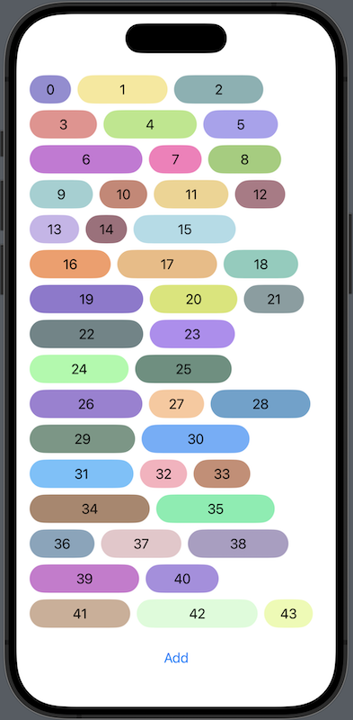
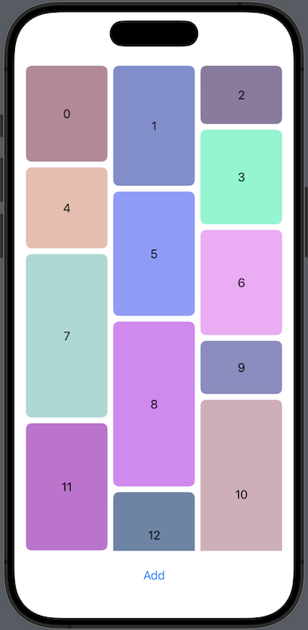

MasonryGrid
===========

A masonry grid layout view for SwiftUI.

|Horizontal|Vertical|
|----------|--------|
|||

## Features

- [x] Vertical scroll.
- [x] Spacing curtomizable.
- [x] Lazy loading.
- [x] Items update can be animated.

## Requirements

- iOS 15.0+ / macOS 12.0+
- Xcode 15.0+
- Swift 5.9+

## Usage

### Basic

It takes an array of data and calculates the optimal arrangement of the data items into rows/columns. The recommended width/height for each item in the grid is required for lazy loading.

```swift
HMasonryGrid(items) { item in
    ItemView(item)
} width: { item in
    item.width
}
```

`VMasonryGrid` requires `numberOfColumns` additionaly.

```swift
VMasonryGrid(items, numberOfColumns: 3) { item in
    ItemView(item)
} height: { item in
    item.height
}
```

### Animation

Use [matchedGeometryEffect](https://developer.apple.com/documentation/swiftui/view/matchedgeometryeffect(id:in:properties:anchor:issource:)) and update items in [withAnimation](https://developer.apple.com/documentation/swiftui/withanimation(_:_:)) block if you want to animate items when they are updated.

```swift
@Namespace var animation

VMasonryGrid(items, numberOfColumns: 3) { item in
    ItemView(item)
        .matchedGeometryEffect(id: item.id, in: animation)
} height: { item in
    item.height
}

withAnimation {
    items.append(/* new item */)
}
```

Currently, there is no support for animating changes in spacing, number of columns, or layout updates due to changes in the display area.

### FrameTrackingMode (HMasonryGrid only)

HMasonryGrid requires recalculation every time the display area (frame) changes. When there are a large number of items, this calculation can be expensive and cause performance issues. Especially on macOS, where the window size can be freely changed, such problems are more likely to occur.

HMasonryGrid provides different operation modes (`FrameTrackingMode`) to avoid this issue:

- `immediate`: Performs calculation immediately every time the frame changes. This mode has the highest rendering cost.
- `backgroundCalculation`: Run calculation in the background thread when the frame changes and immediately reflects the calculation result.
- `debounce`: Delays the calculation using the debounce algorithm to monitor frame changes.

By default, `backgroundCalculation` is selected. Please choose the appropriate mode based on the number of items to display.

You can set `FrameTrackingMode` as follows.

``` swift
HMasonryGrid(items) { item in
    ItemView(item)
} width: { item in
    item.width
}
.environment(\.frameTrackingMode, .debounce(0.15))
```

## License

The MasonryGrid is released under the MIT License. See the [LICENSE](LICENSE.md) file for more information.
